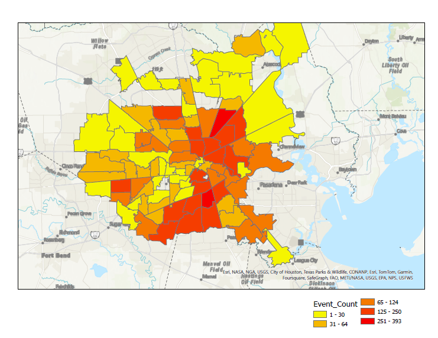
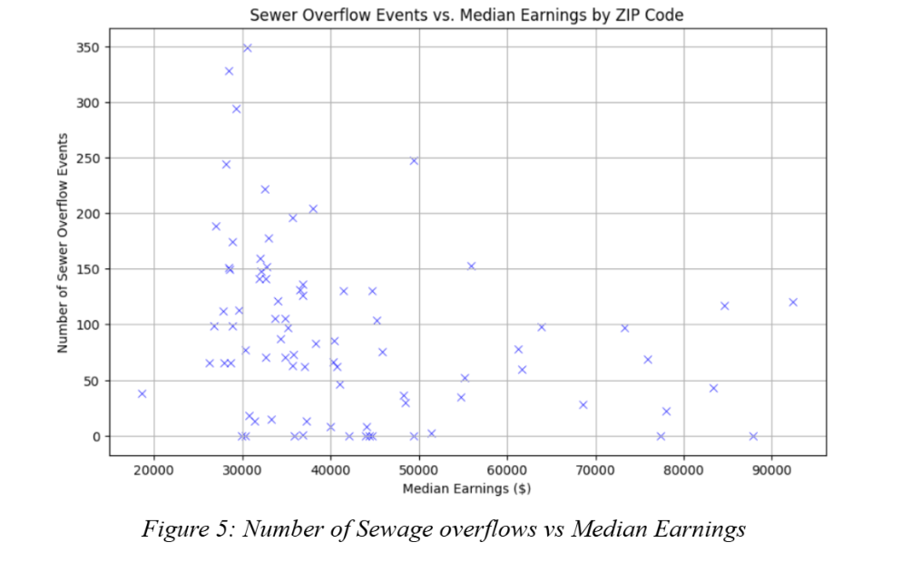
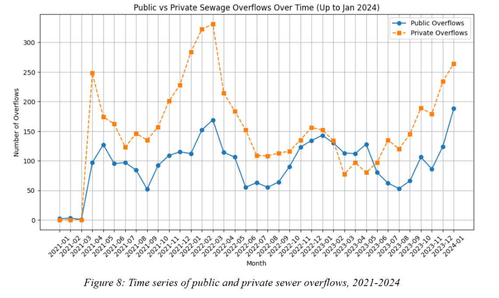

---

#  D2K: Bayou City Waterkeeper - Justice in the Sewers

## Overview 📖

The **Bayou City Waterkeeper** is a non-profit organization with the key missions of improving water quality, protecting wetlands, and mitigating floods in the greater Houston area. The organization focuses on environmental justice in Houston, centering communities that are most affected by water pollution, flooding and system failures. While Bayou City Waterkeeper has multiple active projects, our group will focus on their “Justice in the Sewers” project. This initiative follows a consent decree of $2 billion issued by a federal judge in April 2021, after major sewage overflows affecting Houston communities. The consent decree requires the City of Houston to upgrade their sewage infrastructure over the course of the next 15 years. While infrastructure upgrades are common, Houston’s unique climate and frequent underinvestment in infrastructure has caused more severe events in the past, making this project even more significant. 

Almost 4 years have passed since the consent decree was issued, and while work has been done, Bayou City Waterkeeper has identified gaps in the consent decree. There has been no incentive to support predominantly black and brown communities that have faced historic underinvestment in low quality sewer systems prone to overflows. Additionally, the City of Houston is not responsible for fixing private sewer laterals even if they originate from a public sewage line break. Because of this, many community members are subject to paying out of pocket for breaks occurring on their private property. The consent decree has not outlined any supplemental funding for these incidents, which inevitably discriminates against low income households.  

To better inform Bayou City Waterkeeper’s proposal, our capstone group aims to analyze private sewer lateral data to determine which areas in Houston have a high chance of sewage overflow, analyze socioeconomic factors that may have a relationship with these events, and incorporate rainfall data analysis to predict which areas have a high chance of overflow. 

For more details, please refer to: https://bayoucitywaterkeeper.org/

---

## Table of Contents 📜

* [Overview 📖](#overview-)
* [Team & Acknowledgements 👥](#team--acknowledgements-)
* [Features 🚀](#features-)
* [Project Structure 📁](#project-structure-)
* [Installation and Setup 📥](#installation-and-setup-)
    * [Step 1: Clone the Repository](#step-1-clone-the-repository)
    * [Step 2: Set Up a Python Virtual Environment](#step-2-set-up-a-python-virtual-environment-recommended)
    * [Step 3: Install Python Dependencies](#step-3-install-python-dependencies)
    * [Step 4: R Environment Setup for GWR Model](#step-4-r-environment-setup-for-gwr-model)
* [Data 🗃️](#data-️)
* [Configuration ⚙️](#configuration-️)
* [Usage 🚩](#usage-️)
    * [Generating Periodic Summaries](#generating-periodic-summaries)
* [Output Files 📤](#output-files-)
* [Dependencies 📌](#dependencies-)
* [Descriptions of Relevant EDA](#descriptions-of-relevant-eda)
* [Data Processing Pipeline (`scripts/generate_periodic_summaries.py`) ⚙️](#️-data-processing-pipeline-scriptsgenerate_periodic_summariespy)
* [Experimental Results: Fixed Effects Poisson Regression 🌧️](#️-experimental-results-fixed-effects-poisson-regression)
* [Experimental Results: Geographically Weighted Regression (GWR) 🗺️](#️-experimental-results-geographically-weighted-regression-gwr)

---

##  Team & Acknowledgements 👥

*   **Team Members:** Alex Kornblum, Anika Bjerknes, Isabelle Goodman, Jiahui Wei, Katharine Britt & Saatchi Sagoo-Jones
*   **Faculty Mentor:** Dr. Xinjie Lan
*   **PhD Mentor:** Tyler Bagwell
*   **Project Sponsor:** Bayou City Waterkeeper, Guadalupe Fernandez

---

## Features 🚀

* **Data Loading**: Ingests raw datasets for rainfall, overflow events (public and private), 311 calls, site locations, and demographic information.
* **Data Aggregation**: Converts raw hourly or event-based data into daily counts by zip code, then aggregates these into customizable intervals (e.g., 1-day, 3-day, 7-day summaries).
* **Overflow Data Merging**: Combines and processes public and private overflow datasets.
* **Data Cleaning**: Standardizes and cleans zip code formats.
* **Output Management**: Saves periodic summaries into clearly organized directories.
* **Centralized Configuration**: All paths and settings managed via `config/settings.py`.
* **Analysis Extensions**: Includes directories for notebooks, modeling scripts, utility functions, and visualization, allowing extensive analytical flexibility.

---

## Project Structure 📁

```
Bayou_Sp25/
├── config/                             # Configuration directory
│   ├── settings.py                     # Main config file (paths, parameters)
│   └── __init__.py
├── EDA/                                #
├── Data/                               # Data directory (inputs and outputs)
│   ├── BCW Public and Private Original Data/ # Raw overflow event data
│   ├── Daily_Event_Counts/             # Intermediate data (optional) and formatted 311 calls
│   ├── Demographic Data by Zipcode/    # Demographic data inputs
│   ├── Event Count Data by Zipcode/    # Output summaries for overflow & 311
│   │   └── event_count_summary/
│   ├── Rainfall Complete/              # Intermediate rainfall data
│   ├── Rainfall Data by Zipcode/       # Output summaries for rainfall
│   │   └── rainfall_summary/
│   └── WeatherData/                    # Raw rainfall data and site locations
├── data_process/                       # feature engineering modules
│   ├── feature_engineering.py
│   ├── loaders.py
│   ├── preprocessors.py
│   └── __init__.py
├── main.py                             # Main entry or analysis script 
├── models/                             # Directory for trained models
├── Modeling in R/                      # Scripts for R-based modeling
├── notebooks/                          # Code to get ACS Demographic data
├── outputs/                            # Outputs (figures, models, results)
│   ├── figures/
│   ├── models/                         
│   └── results/
├── scripts/                            # Executable Python scripts
│   └── generate_periodic_summaries.py  # Main data aggregation script
├── utils/                              # Utility scripts and helper functions
├── visualization/                      # Scripts/modules for visualization
├── requirements.txt                    # Python project dependencies
└── README.md                           # Project documentation (this file)
```

---

## Installation and Setup 📥

### Step 1: Clone the Repository

```bash
git clone https://github.com/RiceD2KLab/Bayou_Sp25.git
cd Bayou_Sp25
```

### Step 2: Set Up a Python Virtual Environment (recommended)

```bash
python -m venv venv

# Activate the virtual environment
# Windows:
.\venv\Scripts\activate

# macOS/Linux:
source venv/bin/activate
```

### Step 3: Install Python Dependencies

```bash
pip install -r requirements.txt
```

---

### Step 4: R Environment Setup for GWR Model

If you utilize the R components, ensure you have R installed, and follow these steps to set up the R environment for running the Geographically Weighted Regression (GWR) models:

#### Install Required R Packages

Run the following commands in your R environment to install all necessary packages:

```R
install.packages(c(
  "tidyverse", "lubridate", "tidygeocoder", "sp", "spgwr",
  "GWmodel", "sf", "gstat", "purrr", "tidyr"
))
```

---

## Data 🗃️

The project's data files should be stored under the `Data/` directory. The key files required by `scripts/generate_periodic_summaries.py` include:

* **Raw Rainfall Data:**

  * `Data/WeatherData/2022.0101 thru 2023.0101_cleaned.csv`
  * `Data/WeatherData/2023.0101 thru 2024.0701_cleaned.csv`

* **Raw Overflow Events:**

  * `Data/BCW Public and Private Original Data/Public and Private csv/all_public_data.csv`
  * `Data/BCW Public and Private Original Data/Public and Private csv/combined_private_data.csv`

* **Formatted 311 Call Data:**

  * `Data/Daily_Event_Counts/formatted_311_daily_events_by_zipcode.csv`
    *(Note: This is a pre-processed daily file used directly by the script.)*

* **Site Location Data:**

  * `Data/WeatherData/Site Locations.csv`   
    *(Mapping rainfall measurement sites to zip codes)*

* **Demographic Data:**

  * `Data/Demographic Data by Zipcode/race and income by zipcode.csv`  
    *(Note: This data comes from the American Community Survey (ACS))*  
    *(Get your API key from: https://api.census.gov/data/key_signup.html)*  

Ensure these files are correctly placed before running the summary generation script.

---

## Configuration ⚙️

All project-wide Python settings and parameters are centrally located in the `config/settings.py` file, including:

* Paths to input/output directories and files.
* Names of specific columns (e.g., date columns in raw datasets).
* Date ranges for aggregating data (`AGGREGATION_START_DATE`, `AGGREGATION_END_DATE`).
* Naming conventions for output files.
* Parameters for feature engineering and modeling (`TIME_RESOLUTIONS`, `MODEL_FORMULA`).

You can edit this file directly to adjust paths or parameters.

---

## Usage 🚩

### Generating Periodic Summaries

The primary script for data aggregation is `scripts/generate_periodic_summaries.py`.

To execute the script:

```bash
python scripts/generate_periodic_summaries.py -r <aggregation_period>
```

Replace `<aggregation_period>` with the desired interval length in days (e.g., 1, 3, 7).

**Example (Generate weekly summaries):**

```bash
python scripts/generate_periodic_summaries.py -r 7
```

This script will:

1. Load and process raw rainfall and overflow data into daily counts.
2. Load pre-formatted 311 call data and demographic information.
3. Perform zipcode cleaning and standardization.
4. Aggregate rainfall data (mean of non-zero daily rainfall), overflow events (summation), and 311 call data (summation) over specified periods.
5. Save resulting summaries into CSV files under the `Data/` subdirectories.

---

## Output Files 📤

The aggregation script produces the following summaries:

* **Rainfall Summary:**
  `Data/Rainfall Data by Zipcode/rainfall_summary/rainfall_summary_{aggregation_period}.csv`

* **Overflow Events Summary:**
  `Data/Event Count Data by Zipcode/event_count_summary/overflow_summary_{aggregation_period}.csv`

* **311 Calls Summary:**
  `Data/Event Count Data by Zipcode/event_count_summary/311_summary_{aggregation_period}.csv`

Other outputs (figures, models, results) may be produced by other scripts or notebooks and stored under the `outputs/` directory.

---

## Dependencies 📌

The primary Python dependencies for the project are specified in the `requirements.txt` file and typically include:

* `pandas`
* `numpy`
* *(List other key libraries as used in your project)*

Generate or update this file using pip:

```bash
pip freeze > requirements.txt
```

It is recommended to commit this file to your repository to ensure a consistent environment setup.

---

## Descriptions of Relevant EDA


Here, we want to see where the most private sewage overflow events occur so we can better understand the geopsatial element of this project. We can immediately notice some patterns forming, with southern and northeastern zipcodes having higher event counts overall.



Next, to get a better visualization of how income impacts the number of occurences of sewage overflows, we plotted median household income against overflow event counts. We can definitely see that more overflows occur in zip codes with lower median income. However, we cannot determine whether this is because of any societal pattern, or whether wealthier communities tend to underreport events. With further information from the city of Houston, we hope to better understand this.



When segmenting through time, the amounts of private sewage overflow events vary greatly by year and month. The major peaks occur around January of 2022 and January of 2024. By showing the correlation between these two datasets, we provide justification for analyzing the public data in order to gain insights about the sewage overflows on private land. 


We mapped each overflow event to its nearest rainfall collection site by distance, so that the rainfall amount used for that location would be the most accurate.​​ This is a visual representation of the cumulative rainfall for the whole city of Houston compared to the cumulative number of sewage overflows per month, showing a general pattern of positive correlation. This gives us further information to start modeling.

---

### ⚙️ Data Processing Pipeline (`scripts/generate_periodic_summaries.py`)

This script transforms raw datasets into periodic summaries, preparing data for modeling based on a user-defined time resolution (`-r` days).

1. **Load & Clean:**

   * Loads rainfall, overflow events (public/private), formatted daily 311 calls, and demographics data.
   * Processes rainfall into daily totals per site, merges overflow data, cleans zipcodes, and standardizes demographics.

2. **📅 Periodic Aggregation:**

   * **🌧️ Rainfall:** Computes average of non-zero daily rainfall values by zipcode per period.
   * **Overflows & 311 Calls:** Sums daily event counts by zipcode per period.

3. **Save Summaries:**

   * Outputs aggregated datasets (e.g., `rainfall_summary_7.csv`) into clearly organized directories (`Data/`) for subsequent analysis.

---

### 🌧️ Experimental Results: Fixed Effects Poisson Regression

Using a fixed-effects Poisson model, we analyzed daily sewer overflows by zip code.

* **Best Performance:** 1-day aggregation model (Test MSE ≈ 0.024, accuracy in test set: 0.9877 (98.77%)).

* **Key Predictors:**

  * **7-day cumulative rainfall** significantly increases overflows. Single-day rainfall not significant.
  * **Demographics** (race/ethnicity percentages, median income) positively correlated with overflow frequency.
* **💡 Interpretation:** Sustained rainfall drives overflows; demographic correlations suggest infrastructure disparities .

---

### 🗺️ Experimental Results: Geographically Weighted Regression (GWR)

We used Geographically Weighted Regression (GWR) with monthly data to explore spatial differences.

* **📍 Spatial Variation:** Predictor impacts vary across Houston.

  * **💧 Rainfall & Income:** Strongest effects in **East Houston** (higher rainfall impact, lower-income areas experiencing more overflows).
  * **🧑‍🤝‍🧑 Race/Ethnicity:** Significant Hispanic population impacts concentrated in **Northeast Houston**.
* **📌 Interpretation:** Highlights infrastructure vulnerabilities in East and Northeast Houston, indicating areas for targeted intervention. 

---
